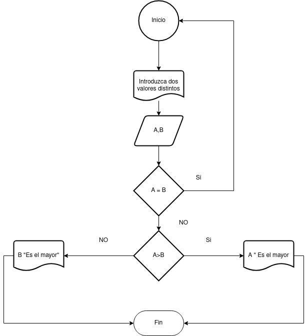

# Ejercicios

- [Ejercicio 1](#ejercicio1)

## Ejercicio 1 
Desarrolle un algoritmo que permita leer dos valores distintos, determinar cual de los dos valores es el
mayor y escribirlo.

### Diagrama de Flujo

### pseudocodigo
 Pasos:
 - Inicio
 - Inicializar variables: A = 0, B = 0
 - Solicitar la introducción de dos
 valores distintos
 - Leer los dos valores
 - Asignarlos a las variables A y B
 - Si A = B Entonces vuelve a 3
 porque los valores deben ser
 distintos
 - Si A>B Entonces
 Escribir A, “Es el mayor”
 - De lo contrario: Escribir B, “Es
 el mayor”
 - Fin_Si 
 - Fin

